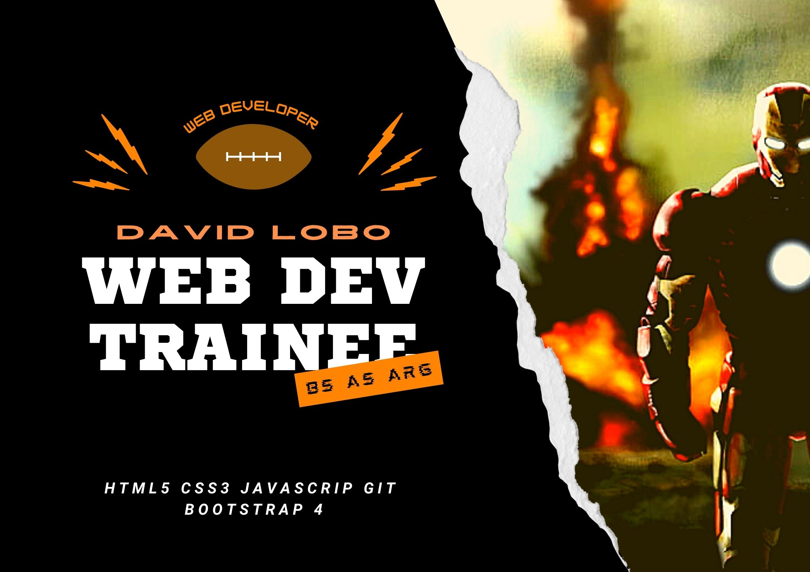

<h2 align="center">Hola mundo. Soy David Lobo👋🤓</h2>

Soy estudiante autodidacta de programación Web Fullstack. (Estudio en Udemy.com)
Realizo maquetación web de manera frelance, para pequeños negocios y clientes de todo el mundo. 
Uso HTML5 CSS3 y JavaScript básico. También uso Bootstrap para mejorar la apariencia del front
También se algo de Java SE.

<h3 align="center">Sientanse libres de contactarme.</h3>

Saludos y gracias por visitar mi perfil de GitHub

